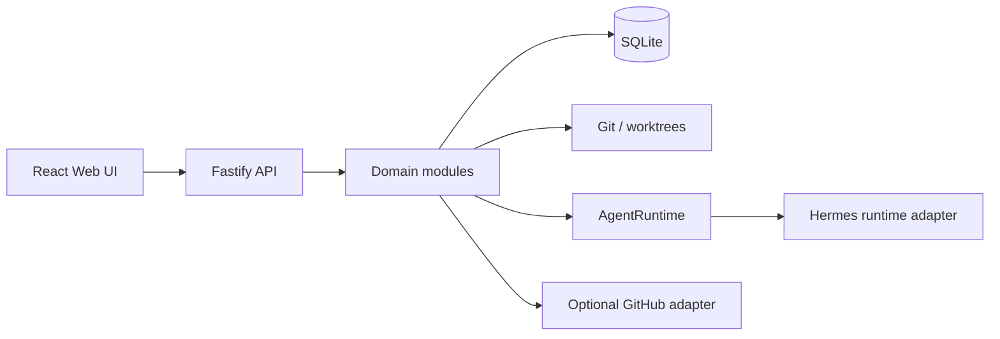

# Ebb Orchestrator

Ebb Orchestrator — локально запускаемый modular monolith для
управления разработкой через задачи, workflow, Git worktrees и агентские
запуски. Проект хранит состояние в SQLite, использует Git как источник
состояния рабочей копии и предоставляет Fastify API и React Web UI.

## Возможности v1

- standalone Task и Epic с разными workflow;
- планирование, зависимости, approvals, recovery и обнаружение отсутствия
  прогресса;
- единый `SchedulerService` с resource locks, concurrency и budget accounting;
- Git branches, worktrees, merge, hooks, reconciliation и журнал операций;
- `Action Gateway` и `Permission Engine` с решениями `ALLOW`, `ASK`, `DENY` и
  `ABSOLUTE_DENY`;
- запуск ролей через абстракцию `AgentRuntime` и адаптер Hermes;
- MCP-интеграция с capability validation и инструментом `submit_result`;
- локальные события, outbox, фоновые jobs и восстановление после перезапуска;
- необязательная синхронизация с GitHub;
- Web UI для dashboard, проектов, задач, Epic, запусков, approvals, execution,
  settings и usage.

### Граница текущей production-композиции

Ядро доменных workflow, Git, scheduler, outbox, SecretStore/Infisical и
production artifact покрыты тестами и доступны локальному серверу. При этом
текущая HTTP-композиция v1 предоставляет health/session, read projections,
settings, pause/cancel и approval mutation endpoints; полный пользовательский
flow `создание проекта → запуск Hermes → integration → merge` пока не подключён
как единый публичный API flow. Поэтому README описывает доменные возможности,
а production sign-off должен отдельно подтвердить wiring этих mutation paths,
recovery adapters и live runtime credentials.

## Архитектурные принципы

Проект следует следующим ограничениям:

- **deterministic-first** — переходы workflow, guards, budgets и разрешения
  вычисляются кодом, а не свободным текстом агента;
- **modular monolith** — сервер развёртывается как одно приложение с явными
  модулями и портами;
- **Ports & Adapters** — доменные сервисы отделены от SQLite, Git, процесса,
  Hermes и GitHub adapters;
- **local-first** — локальное состояние и локальный workflow работают без
  GitHub;
- **Git/SQLite ownership** — SQLite хранит состояние оркестрации, Git и
  worktree отражают состояние исходного кода, repo config остаётся отдельным
  источником настроек репозитория;
- **worktrees** — параллельные рабочие контексты изолируются через Git
  worktree;
- **Action Gateway / Permission Engine** — действия проходят через
  классификацию, policy и capability checks;
- **Reviewer/QA и approvals** — переходы, требующие проверки или согласия,
  не считаются завершёнными только по выводу агента;
- **recovery** — после запуска и ошибок система сверяет сохраняемое состояние
  с наблюдаемым состоянием Git, jobs, runs и budgets.

## Архитектура высокого уровня



## Роли агентов

Роли и их контракты определены в `packages/contracts/src/roles/` и runtime-
реестре. Координатор управляет жизненным циклом работы и распределением;
Developer изменяет код в выделенном worktree; Architect отвечает за
архитектурные решения; Product Manager уточняет требования; Reviewer и QA
проверяют результат; Integration занимается интеграцией; DevOps отвечает за
операционные аспекты. Конкретное разрешение действия определяется сервером,
а не названием роли.

## Требования

- Node.js `>=24.15 <25`;
- pnpm `12.4.2` (версия закреплена в `package.json`);
- Git с поддержкой branches и worktrees;
- ОС, поддерживаемая Node.js и Git. Для Hermes нужен установленный и
  доступный в окружении Hermes runtime;
- GitHub не требуется для локального workflow.

Проверить версии:

```bash
node --version
pnpm --version
git --version
```

## Быстрый старт

Установить зависимости из lockfile и выполнить проверки:

```bash
pnpm install --frozen-lockfile
pnpm lint
pnpm typecheck
pnpm test
```

Запустить backend в режиме разработки:

```bash
pnpm --filter @ebb-orchestrator/server dev
```

Запустить Web UI в другом терминале:

```bash
pnpm --filter @ebb-orchestrator/web dev
```

Сервер по умолчанию слушает loopback `127.0.0.1:3000`; порт можно изменить
через `PORT`. Команды и порты следует проверять по текущему `package.json` и
конфигурации перед использованием в автоматизации.

## Backend и Web UI

Backend — пакет `@ebb-orchestrator/server`: Fastify API, startup lifecycle,
SQLite, scheduler, Git, runtime, MCP и фоновые workers.

Production build:

```bash
pnpm --filter @ebb-orchestrator/server build
```

Web UI — пакет `@ebb-orchestrator/web`, собираемый Vite:

```bash
pnpm --filter @ebb-orchestrator/web build
```

Веб-пакет не является границей безопасности: mutating actions должны
проверяться backend policy и capability checks.

## Структура репозитория

```text
apps/server/src/       Fastify API, platform и доменные модули
apps/server/test/      unit, scenario и e2e tests
apps/web/src/           React Web UI
packages/contracts/     общие доменные контракты и role contracts
packages/testing/       повторно используемые test helpers
```

Внутри `apps/server/src/modules/` находятся `work`, `workflow`, `planning`,
`scheduler`, `recovery`, `git`, `execution`, `permissions`, `runtime`,
`projects`, `github`, `usage`, `context` и связанные подсистемы. Platform-
слой содержит database, events, jobs, process, security и home.

## Жизненный цикл standalone Task

Task создаётся в доменной модели, проходит workflow guards и получает контекст,
зависимости, budget и необходимые approvals. Scheduler выбирает допустимую
работу с учётом resource locks и concurrency. Runtime запускается в отдельном
контексте, а результаты проходят validation, findings и проверки Reviewer/QA.
Завершение и последующие переходы сохраняются в SQLite; Git-изменения
проверяются отдельными Git-операциями. При ошибке recovery использует
сохраняемое состояние и progress fingerprint, а не только последний stdout.

## Жизненный цикл Epic

Epic состоит из связанных задач и плановых фаз. Planning формирует и
валидирует план, зависимости определяют доступность задач, а orchestrator
переводит дочерние задачи через допустимые состояния. Integration и merge
выполняются только после соответствующих guards, approvals и проверок. Epic
не превращает недостоверный результат отдельной задачи в автоматически
подтверждённый общий результат.

## Hermes Runtime

`AgentRuntime` — порт, не обещающий конкретную реализацию транспорта. Текущая
реализация `HermesRuntimeAdapter` управляет profile/session/context и
выделенными capability для запуска. Среда subprocess собирается по allowlist;
чувствительные credentials вроде `GITHUB_TOKEN` и `SSH_AUTH_SOCK` не должны
передаваться агентскому процессу.

MCP-инструменты проверяют capability и аргументы. `submit_result` является
границей авторитетного структурированного результата; stdout/stderr служат
диагностикой и не заменяют validation результата. Для некорректного результата
предусмотрены ограниченные попытки исправления, после чего запуск должен
перейти в обработку ошибки или recovery.

## Модель безопасности

Недоверенными считаются ввод пользователя, repo config, пути, команды,
параметры MCP и вывод runtime. `Permission Engine` применяет упорядоченную
policy, а `Action Gateway` не должен обходиться прямым вызовом адаптера.
Проверки path containment и классификации shell-команд выполняются на backend.

> **Важно:** Local Mode обеспечивает изоляцию политик, а не песочницу ОС.
> Он не делает произвольный процесс безопасным при компрометации самой среды.

Не храните secrets и tokens в README, исходном коде или Git. GitHub credentials
имеют границу adapter/runtime и не являются общим контекстом агента.

## Git и worktrees

Git-модуль работает с выбранным repository и worktree, фиксирует операции в
журнале и поддерживает reconciliation после перезапуска.

**Безопасность worktree:** удаление managed worktree выполняется только после
проверки на отсутствие неоткоммиченных изменений. Dirty worktree не удаляется
автоматически — это предотвращает потерю пользовательских данных.

Hooks и сетевые операции являются внешними побочными эффектами и проходят
соответствующие guards. Merge/reconciliation не должны объявлять SQLite и
рабочую копию согласованными без проверки фактического Git-состояния.

## Конфигурация

`EBB_ORCHESTRATOR_HOME` имеет приоритет над платформенным home и определяет каталог
локального состояния. `PORT` задаёт порт backend и по умолчанию равен `3000`.
Runtime использует `HERMES_HOME`, `HERMES_CONFIG` и разрешённые runtime keys,
которые формирует адаптер; профиль не должен наследовать произвольное
окружение процесса. Для MCP также поддерживаются `EBB_ORCHESTRATOR_CAPABILITY_REF`,
`EBB_ORCHESTRATOR_RESULT_FILE` и `EBB_ORCHESTRATOR_DATABASE` согласно CLI-коду.

Не добавляйте обычные настройки в `.env` вместо конфигурации и не передавайте
секреты через публичные примеры.

### Production build и запуск

Собирайте server и его runtime-зависимость contracts одной командой. Результат
сервера — `apps/server/dist/main.js`; migrations копируются в artifact, поэтому
запуск не требует `tsx` или TypeScript-исходников.

```bash
pnpm server:build
pnpm --filter @ebb-orchestrator/web build
pnpm --filter @ebb-orchestrator/server start
```

Перед запуском задайте отдельный доступный для записи `EBB_ORCHESTRATOR_HOME`.
Проверить готовность после запуска можно запросом
`GET /api/v1/health`, который возвращает `{ "status": "ok" }`.

### SecretStore

По умолчанию backend использует локальный OS keyring (`@napi-rs/keyring`): на
Windows это Credential Manager. Если keyring недоступен, API секретов отвечает
`503` и не создаёт SQLite metadata — это fail-closed поведение.

Опционально можно включить Infisical Cloud или self-hosted Infisical:

```text
EBB_SECRET_BACKEND=infisical
INFISICAL_CLIENT_ID=...
INFISICAL_CLIENT_SECRET=...
INFISICAL_PROJECT_ID=...
INFISICAL_ENVIRONMENT=production
# Необязательные: INFISICAL_SECRET_PATH=/orchestrator
#                 INFISICAL_SITE_URL=https://app.infisical.com
```

Используйте отдельную Machine Identity с минимальными правами только на
назначенные project/environment/path. Эти значения передаются процессу через
безопасный механизм deployment environment, а не через Git, prompts или UI.
При включённом Infisical неполная конфигурация останавливает startup; ошибка
remote backend возвращает `503` и не переключается неявно на другой storage.

## Локальные данные

По умолчанию используется `~/.ebb-orchestrator` (на Windows — каталог из
`USERPROFILE`), либо значение `EBB_ORCHESTRATOR_HOME`. Внутри создаются:

```text
.ebb-orchestrator/
├── ebb-orchestrator.db
```
├── artifacts/
├── runtime/
├── logs/
├── backups/
└── worktrees/
```

SQLite является локальным хранилищем состояния оркестрации. Startup lifecycle
имеет порядок `STARTING → RECOVERING → READY`; перед `READY` выполняются
миграции, reconciliation outbox/jobs/artifacts и зарегистрированных модулей.

## GitHub integration

GitHub — необязательный adapter для синхронизации с hosting API. Локальный
workflow не должен останавливаться только из-за отсутствия GitHub. Синхронизация
должна быть идempotent; ошибки adapter сохраняются как диагностируемое
состояние и не превращаются в ложное подтверждение локального результата.

## Качество и тестирование

Корневые команды workspace:

```bash
pnpm install --frozen-lockfile
pnpm lint
pnpm typecheck
pnpm test
pnpm server:build
pnpm --filter @ebb-orchestrator/web build
git diff --check
```

`pnpm lint` включает обязательную JSDoc-policy для production source:
наличие комментариев у настроенных публичных классов и функций, непустые
описания, корректные имена параметров и тегов, а также синтаксис JSDoc.
Все комментарии к production-коду пишутся на русском языке. Тестовые
fixtures не входят в обязательное покрытие JSDoc.

## Диагностика

- Если сервер не запускается, проверьте `EBB_ORCHESTRATOR_HOME`, наличие прав на
  каталог, занятый single-instance lock и доступность `PORT`.
- Если состояние осталось в `RECOVERING`, исследуйте migrations,
  reconciliation, outbox/jobs и журналы в `logs/`.
- Если действие отклонено, проверьте policy decision, capability и containment
  пути; не обходите `Action Gateway` прямым вызовом.
- Если run имеет ошибочный или неполный результат, проверяйте
  `submit_result`, validation и usage, а не только stdout/stderr.
- При расхождении Git и SQLite сначала запускайте reconciliation и сохраняйте
  журнал операции; не исправляйте состояние ручным удалением записей.
- Ошибки GitHub диагностируйте отдельно от локального workflow.

## Ограничения v1

- Local Mode не является OS sandbox.
- В README не обещается производительность, распределённая HA-архитектура или
  удалённая многопользовательская изоляция.
- Hermes должен быть доступен как runtime; универсальный fallback другого
  провайдера проектом не заявлен.
- GitHub остаётся optional integration и не заменяет локальные Git/SQLite
  источники истины.
- Политики, permissions и recovery ограничены реализованным v1-кодом; будущие
  возможности нельзя считать доступными до их реализации.

## Разработка и вклад

Перед изменением кода прочитайте design и соответствующий plan. Для изменений
workflow, permissions, Git, persistence или runtime добавляйте тесты и
проверяйте влияние на инварианты. Новый экспортируемый production API должен
иметь полезный русский JSDoc по
[`docs/development/jsdoc-style-guide.md`](docs/development/jsdoc-style-guide.md).

Не изменяйте runtime ради прохождения lint, не добавляйте blanket excludes и не
выдумывайте контракт, которого нет в реализации. Перед отправкой изменений
запускайте lint, typecheck, test, Web build и `git diff --check`.
## Лицензия

В репозитории не найден файл лицензии; отдельная лицензия этим README не
заявляется.
